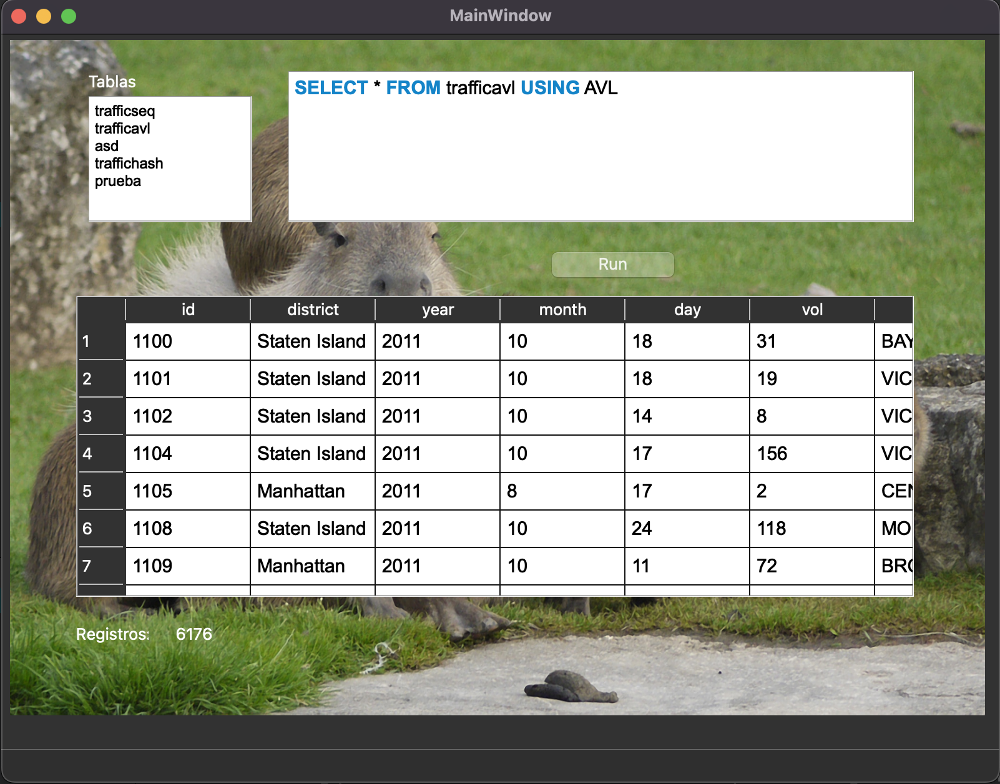

# Proyecto 1 BD2 - Organización de Archivos 

# Team - Group 5
| <a href="https://github.com/anaaccilio2004" target="_blank">**Ana Maria Accilio Villanueva**</a> | <a href="https://github.com/Diegospf12" target="_blank">**Diego Pacheco Ferrel**</a> | <a href="https://github.com/juanpedrovv" target="_blank">**Juan Pedro Vasquez Vilchez**</a> | <a href="https://github.com/LuisEnriqueCortijoGonzales" target="_blank">**Luis Enrique Cortijo Gonzales**</a> | <a href="https://github.com/marceloZS" target="_blank">**Marcelo Mario Zuloeta Salazar**</a> |
| :----------------------------------------------------------------------------------------------: | :----------------------------------------------------------------------------------: | :-----------------------------------------------------------------------------------------: | :-------------------------------------------------------------------------------------------------------------: | :------------------------------------------------------------------------------------------: |
|  |  |  |  |  |


<a name="readme-top"></a>
<details open>
  <summary><h2>Tabla de contenidos:<h2></summary>
  <ul>
    <li><a href="#Introducción-🖊">Introducción
      <ul>
        <li><a href="#objetivo-del-proyecto">Objetivo del proyecto</a></li>
             <ul>
               <li><a href="#Principal">Principal</a></li>
               <li><a href="#Secundarios">Secundarios</a></li>
             </ul>
        <li><a href="#Dominio-de-datos">Dominio de datos</a></li>
        <li><a href="#Resultados-esperados">Resultados esperados</a></li>
      </ul>
    </a></li>
    <li><a href="#Técnicas-Utilizadas">Técnicas Utilizadas</a></li>
      <ul>
        <li><a href="#Técnicas-de-indexación">Técnicas de indexación</a></li>
            <ul>
              <li><a href="#Extendible-Hashing">Extendible Hashing</a></li> 
              <li><a href="#AVL">AVL</a></li>   
              <li><a href="#Sequential-File">Sequential File</a></li> 
          </ul>
        <li><a href="#Operaciones-implementadas">Operaciones implementadas</a></li>
        <li><a href="#Análisis-comparativo">Análisis comparativo - Conceptual</a></li>
        <li><a href="#SQL-Parser">SQL Parser</a></li>
          <ul>
               <li><a href="#Consultas">Consultas</a></li>   
          </ul>
      </ul>
    </a></li>    
    <li><a href="#Resultados-experimentales">Resultados experimentales</a></li>
    <li><a href="#Gráfico-Comprativo">Gráfico comparativo de las técnicas de indexación</a></li>
    <li><a href="#Interfaz-gráfica">Interfaz gráfica</a></li>
   <li><a href="#Funcionalidad-del-aplicativo"></a>Funcionalidad del aplicativo</li>
    <li><a href="#conclusiones">Conclusiones</a></li>
    <li><a href="#Team-group5">Team - Group 5</a></li>
    <li><a href="#referencias-bibliográficas">Referencias bibliográficas</a></li>
</details>

<hr>

# Introducción
En este proyecto, implementaremos y manipularemos técnicas de organización de archivos en memoria secundaria, conjuntamente con un parser de código SQL para ejecutar sentencias.

## Objetivo del proyecto
### Principal
- La organización física de archivos en memoria secundaria es la base para la creación y utilización de los diferentes sistemas de gestión de bases de datos (DBMS). En un entorno cada vez más orientado hacia la información, la estructuración eficiente de los archivos en memoria secundaria es esencial para garantizar la integridad, disponibilidad y rendimiento de los datos almacenados. Nuestro proyecto esta orientado a aplicar diferentes técnicas de organización de archivos como son las de **Sequential File Organization**, **AVL File Organization** y **Extendible Hashing** para la gestión de registros en memoria secundaria.

### Secundarios
- Implementar operaciones en los registros de forma eficiente, a través de una GUI para hacer consultas con sentencias SQL.
- Identificar las ventajas y desventajas de cada técnica de organización.

## Dominio de datos

- NYC Traffic Volume

Utilizamos un `DataSet` de Recuentos automatizados del volumen de tráfico de la ciudad de Nueva York. El Departamento de Transporte de la ciudad de Nueva York (NYC DOT) utiliza registradores de tráfico automatizados (ATR) para recopilar muestras de recuentos de volumen de tráfico en cruces de puentes y carreteras.  

La lección de datos fue debido a los siguientes factores:
- Los atributos son de tipo `int` y `char`.
- Hicimos limpieza de datos, por lo que no contamos con celdas `NULL` o caracteres `no ASCII`.
- El DataSet cuenta con más de 1000 000 de registros y 7 atributos.
- El llave es única, en este caso trabajamos con el `id`.

Estos son los atributos del DataSet: 
```cpp
struct Record
{
    int id;
    char district[15];
    int year;
    int month;
    int day;
    int vol;
    char street[30];
}
```

|    **Campo**    |                            **Descripción**                                          | 
|:---------------:|:-----------------------------------------------------------------------------------:|
| ```id```        |             Un ID único que se genera para cada solicitud de recuento               |  
| ```district```  | En cuál de las divisiones administrativas de Nueva York se encuentra la ubicación | 
| ```year``` | El año de la fecha que se realizó el conteo | 
| ```month``` | El mes de la fecha que se realizó el conteo |
| ```day``` | El día de la fecha que se realizó el conteo|
| ```vol``` | El volumen recopilado de incrementos en 15 minutos |
| ```street``` | La calle donde se realizó el conteo |

## Resultados esperados

Se busca obtener una optimización significativa de los tiempos de inserción y consulta de registros en nuestro sistema a través de los accesos a memoria secundaria. 
- Con `Sequential File`, anticipamos una aceleración en la inserción ordenada de registros, lo que mejorará la eficiencia en la consulta secuencial y búsqueda binaria.
- La estructura de árbol `AVL` permitirá búsquedas en tiempo logarítmico en base a la cantidad de registros en el archivo, beneficiando las consultas por llave primaria.
- El uso de `Extendible hashing` agilizará la inserción y consulta de registros distribuyendo eficientemente los datos en bloques de almacenamiento en base a una funcion hash.


# Técnicas utilizadas
## Técnicas de indexación
Las estructuras que implementaremos son: `Extendible hashing` , `AVL` , `Sequential File`.

### Extendible Hashing

### AVL File Organization
La técnica de organización de archivos AVL File se basa en la utilización de árboles AVL para almacenar registros de manera ordenada y balanceada en un archivo, basada en la estructura de árboles AVL (árbol binario de búsqueda) en la que se garantiza que la diferencia de alturas entre los subárboles izquierdo y derecho de cada nodo (conocida como el factor de equilibrio) no excede más de uno. Esto asegura que el árbol esté siempre balanceado, lo que, a su vez, garantiza que las operaciones de búsqueda, inserción y eliminación sean eficientes con un tiempo de ejecución en el peor caso de O(log n), donde "n" es el número de nodos en el árbol.

La técnica de organización de archivos AVL File se utiliza en situaciones en las que es necesario realizar operaciones de búsqueda y manipulación eficientes en un archivo de registros. Cada nodo en el árbol AVL representa un registro en el archivo y contiene información sobre el registro, así como punteros a los nodos hijos izquierdo y derecho. La estructura del árbol garantiza que los registros se almacenan en un orden específico que facilita la búsqueda binaria, lo que resulta en tiempos de búsqueda muy eficientes.

En las operaciones de eliminación en un archivo AVLFile, se localiza el nodo que contiene el registro a eliminar y se efectúan rotaciones para mantener el equilibrio y la altura adecuada en el árbol. La eliminación física del elemento en el archivo se pospone hasta que se realice un rebuild.


- *Métodos importantes*
  1. Record find: Busca un registro en el árbol AVL según una clave dada.
     ```cpp
     Record find(long pos_node, int key, ifstream& file){
        Record record;
        file.seekg(pos_node, ios::beg);
        file.read((char*)&record, sizeof(Record));

        if (record.cod == key) {
            return record;
        } else {
            if (key > record.cod) {
                if (record.right != -1) {
                    return find(record.right, key, file);
                } else {
                    Record notFoundRecord;
                    notFoundRecord.cod = -1;
                    return notFoundRecord;
                }
            } else if (key < record.cod) {
                if (record.left != -1) {
                    return find(record.left, key, file);
                } else {
                    Record notFoundRecord;
                    notFoundRecord.cod = -1;
                    return notFoundRecord;
                }
            }
        }
       }
    
     ```
  2. void insert(Record record): Inserta un nuevo registro en el árbol AVL.
     ```cpp
     void insert(long pos_node, Record record, fstream& file){
        file.seekg(0, ios::end);
        if(file.tellg() == 0){
            file.write((char*)&record, sizeof(Record));
            return;
        }

        Record curr_record;
        file.seekg(pos_node, ios::beg);
        file.read((char*)&curr_record, sizeof(Record));

        if(record.cod < curr_record.cod){
            if(curr_record.left == -1){
                file.seekp(0, ios::end);
                curr_record.left = file.tellg();
                file.write((char*)&record, sizeof(Record));
                file.seekg(pos_node, ios::beg);
                file.write((char*)&curr_record, sizeof(Record));
            }
            else
                insert(curr_record.left, record, file);
        }else if(record.cod > curr_record.cod){
            if(curr_record.right == -1){
                file.seekp(0, ios::end);
                curr_record.right = file.tellg();
                file.write((char*)&record, sizeof(Record));
                file.seekg(pos_node, ios::beg);
                file.write((char*)&curr_record, sizeof(Record));
            }
            else
                insert(curr_record.right, record, file);
        }

        updateHeight(pos_node, file);
        balance(pos_node, file);

       }
     ```
  3. void remove(T key): Elimina un registro del árbol AVL según una clave dada.
     ```cpp
     void remove(long pos_node, T key, fstream& file){
        if(pos_node == -1)
            return;
        Record curr_record;
        file.seekg(pos_node, ios::beg);
        file.read((char*)&curr_record, sizeof(Record));

        if(key < curr_record.cod)
            remove(curr_record.left, key, file);
        else if(key > curr_record.cod)
            remove(curr_record.right, key, file);
        else{
            if(curr_record.left == -1 && curr_record.right == -1){
                curr_record.cod = -1;
                file.seekp(pos_node, ios::beg);
                file.write((char*)&curr_record, sizeof(Record));
            }
            else if(curr_record.left == -1){
                Record right_record;
                file.seekg(curr_record.right, ios::beg);
                file.read((char*)&right_record, sizeof(Record));
                curr_record.cod = right_record.cod;
                curr_record.right = right_record.right;
                curr_record.left = right_record.left;
                file.seekp(pos_node, ios::beg);
                file.write((char*)&curr_record, sizeof(Record));
            }
            else if(curr_record.right == -1){
                Record left_record;
                file.seekg(curr_record.left, ios::beg);
                file.read((char*)&left_record, sizeof(Record));
                curr_record.cod = left_record.cod;
                curr_record.right = left_record.right;
                curr_record.left = left_record.left;
                file.seekp(pos_node, ios::beg);
                file.write((char*)&curr_record, sizeof(Record));
            }
            else{
                Record left_record;
                file.seekg(curr_record.left, ios::beg);
                file.read((char*)&left_record, sizeof(Record));
                curr_record.cod = left_record.cod;
                curr_record.right = left_record.right;
                curr_record.left = left_record.left;
                file.seekp(pos_node, ios::beg);
                file.write((char*)&curr_record, sizeof(Record));
                remove(curr_record.left, left_record.cod, file);

            }
        }
        updateHeight(pos_node, file);
        balance(pos_node, file);

       }
     ```
  4. vector<Record> searchRange(int start, int end, int i, vector<struct Record> vector): Busca registros en un rango específico de claves en el árbol AVL.
     ```cpp
     void searchRange(long pos_node, int start, int end, vector<Record>& result, ifstream& file){
        if(pos_node == -1)
            return;
        Record curr_record;
        file.seekg(pos_node, ios::beg);
        file.read((char*)&curr_record, sizeof(Record));

        if(curr_record.cod >= start && curr_record.cod <= end){
            result.push_back(curr_record);
            searchRange(curr_record.left, start, end, result, file);
            searchRange(curr_record.right, start, end, result, file);
        }
        else if(curr_record.cod < start)
            searchRange(curr_record.right, start, end, result, file);
        else if(curr_record.cod > end)
            searchRange(curr_record.left, start, end, result, file);
       }
     ```


### Sequential File Organization
La técnica de organización de archivos llamada Sequential File es una forma de organizar y almacenar datos en un archivo, donde los registros se almacenan en secuencia, uno tras otro. Es como una lista de elementos, donde cada elemento tiene un número de posición. En este tipo de archivo, los registros están en un orden específico y se pueden acceder uno tras otro, desde el principio hasta el final, sin saltos.


En este proyecto, utilizamos esta técnica para guardar datos de manera simple y eficiente. Es útil cuando no se necesita un acceso aleatorio a los datos y cuando la prioridad es la simplicidad y la eficiencia en la lectura y escritura de registros en orden.

#### *Métodos importantes*

##### 1. add(Record record): Agrega un nuevo registro al archivo de datos siguiendo una lógica específica. Dependiendo de ciertas condiciones, los registros se pueden agregar al archivo auxiliar o al archivo de datos principal.
     
Antes de insertar cualquier elemento en un Sequential File, se debe de tomar en cuenta que directamente nunca se va a escribir un elemento en el archivo data.bin (nuestro archivo principal). Todo elemento nuevo va a ser insertado en el archivo auxiliar.bin (nuestro archivo auxiliar), y cuando auxiliar.bin ya este lleno de registros haremos un rebuild. El rebuild nos permite trasladar todos los elementos pertenecientes a data.bin y a auxiliar.bin de manera ordenada a un nuevo archivo data.bin.

Si deseamos insertar un elemento “record”, lo primero que debemos hacer es buscar de forma binaria después de que elemento X (perteneciente al data.bin), según su orden alfabético, estaría nuestro record. Cabe recalcar que si se encuentra otro elemento X+n mayor (alfabeticamente) a X y que además “record” va después que X+n (según ASCII) entonces siempre elegiremos a X+n como el nuevo antecesor de “record”, osea el nuevo X.

```cpp
int X_pos = binarySearchPosition(record) - 1; //binarySearchPOS me devuelve la pos donde debo insertar el elemento, por eso el -1
Record X = readRecord(X_pos,this->data_file);
```


Ahora que identificamos nuestro X (antecesor más próximo a record según ASCII), actuaremos de distinta forma si X apunta a un elemento perteneciente al mismo data.bin ó si apunta a un elemento perteneciente al auxiliar.bin

**Si X apunta a un elemento perteneciente al mismo data.bin** entonces insertaremos a “record” al final del archivo auxiliar.bin. Posteriormente, si X apuntaba a PosY (X → PosY) ahora “record” apuntará a PosY también (record → PosY), y X ahora apuntará a la posición en la que fue insertado “record” en el auxiliar.bin (X→PosRecord).

```cpp
   if(analyzeFloat(X.Puntero)=="Data"){
       //Agregamos el record al aux y hacemos el cambiaso de punteros entre X y record
       record.Puntero = X.Puntero; //record -> X.Puntero
       writeRecordEND(record, this->aux_file);
       updatePunteroAtPosition(X_pos, aux_size, this->data_file); // X -> pos(record)

       //No olvidarse de aumentar la cantidad de elementos que hay en el auxiliar.bin
       aux_size += 1;
   }
```


Al hacer ese cambio en los punteros nos aseguremos que X siempre apunte al elemento sucesor más próximo (según ASCII) perteneciente al archivo auxiliar. Esto nos servirá por si queremos hacer un search, nuestro archivo va a estar bien “conectado” por los punteros y gracias a eso vamos a poder hacer busquedas más efectivas puesto que el archivo estaría ordenado. Además cuando hacemos rebuild, puesto que los elementos estan “conectados” según su orden alfabético, este será más efectivo en términos de eficiencia.

**Si X apunta a un elemento perteneciente al archivo auxiliar,** entonces si X apunta a PosY tendré que ubicarme en la posición PosY del archivo auxiliar.

```cpp
   if(analyzeFloat(X.Puntero)=="Auxiliar"){
       //Si apunta a un auxiliar primero me tengo que ubicar en auxiliarfile[X.Puntero]

       //Y_pos = X.Puntero;
       Record Y = readRecord(X.Puntero,this->aux_file);
```


**Ahora estamos frente a un caso especial.** Al analizar el gráfico nos damos cuenta que X esta en DATA FILE e Y está en AUX FILE, lo que puede llegar a ser problemático. Para ello veremos dos posibles casos:

- En caso queramos insertar un elemento que sea anterior alfabéticamente a Y. Siendo Y el unico elemento que por el momento pertenece al grupo de sucesores de X en el AUXILIAR. En el ejemplo, nos damos cuenta que Baldor va despues que Azucena en el DATA, pero Azucena apunta a un elemento que pertenece al AUXILIAR, en este caso Manuel. Ya en el AUXILIAR preguntamos si “record” va despues que Manuel, y la respuesta es NO, por lo que tendremos que insertar “record” antes que Manuel.

```cpp
if(analyzeFloat(X.Puntero)=="Auxiliar"){
       //Si apunta a un auxiliar primero me tengo que ubicar en auxiliarfile[X.Puntero]

       //Y_pos = X.Puntero;
       Record Y = readRecord(X.Puntero,this->aux_file);

       int cmp = record.compare(Y);
       if (cmp <= 0){ //Si record va antes que Y o es igual a Y
           //Agregamos el record al aux y hacemos el cambiaso de punteros entre X y record
           record.Puntero = X.Puntero; //record -> X.Puntero
           writeRecordEND(record, this->aux_file);
           updatePunteroAtPosition(X_pos, aux_size, this->data_file); // X -> pos(record)

           //No olvidarse de aumentar la cantidad de elementos que hay en el auxiliar.bin
           aux_size += 1;
       }
```


En caso queramos insertar un elemento que sea posterior alfabéticamente a Y. Siendo Y el unico elemento que por el momento pertenece al grupo de sucesores de X en el AUXILIAR.  En el ejemplo, nos damos cuenta que Nando va después que Azucena en el DATA, pero Azucena apunta a un elemento que pertenece al AUXILIAR, en este caso Manuel. Ya en el AUXILIAR preguntamos si “record” (Nando) va despues que Manuel, y la respuesta es SI, pero observamos que Manuel ya no apunta a ningun otro elemento, por lo que tendremos que insertar “record” después que Manuel.

```cpp
//Si record va despues que Y
       if (cmp > 0){
           if (analyzeFloat(Y.Puntero) == "Data"){
               record.Puntero = Y.Puntero;
               writeRecordEND(record, this->aux_file);
               updatePunteroAtPosition(X.Puntero, aux_size, this->aux_file); // X -> pos(record)
               //No olvidarse de aumentar la cantidad de elementos que hay en el auxiliar.bin
               aux_size += 1;
           }
```


**(Si tanto X como Y ahora pertenecen al archivo AUXILIAR)** En caso Y no sea el único elemento que  pertenece al grupo de sucesores de X en el AUXILIAR, posiblemente tengamos que movernos de puntero en puntero dentro del AUXILIAR hasta que encontremos al mejor candidato a antecesor de “record”. 

- Lo que vamos a hacer es movernos según los punteros (osea en el orden alfabético) preguntando si nuestro “record” va despues que el elemento i. En caso la respuesta sea SI el nuevo elemento i va a ser el i+1.
  
```cpp
//Ahora si tanto X como Y pertenecen a auxiliar file
           else {
               bool posicionado = false;
               int cmp2;
               while(!posicionado){

                   X_pos = X.Puntero; //X_pos = Y_pos
                   X = readRecord(X_pos,this->aux_file);

                   //Y_pos = X.Puntero
                   Y = readRecord(X.Puntero,this->aux_file);

                   cmp2 = record.compare(Y);
						/*

                    En caso record vaya despues que Y pero Y apunta a otro elemento perteneciente a auxixiliar.bin
                    (osea no se ha llegao al final)

                    Se repite el while y con ello
                    -  X pasa a ser Y(1)
                    -  Y pasa a ser el Y(1).Puntero

            */
```


Vamos a dejar de movernos de puntero en puntero bajo dos condiciones:

- Si detectamos que “record” esta antes que algún Y.
```cpp
				  			//Si record va antes que Y
                   if (cmp2 <= 0){
                       //Agregamos el record al aux y hacemos el cambiaso de punteros entre X y record
                       record.Puntero = X.Puntero; //record -> X.Puntero
                       writeRecordEND(record, this->aux_file);
                       updatePunteroAtPosition(X_pos, aux_size, this->aux_file); // X -> pos(record)

                       //No olvidarse de aumentar la cantidad de elementos que hay en el auxiliar.bin
                       aux_size += 1;

                       posicionado = true;
                   }
```


En este caso nos hemos movido de puntero en puntero hasta que nos percatamos que Monarca (”record”) esta antes que Nando (Y), por lo que lo insertamos antes que Nando.

- O si detectamos que que “record” va después que algún Y, pero este Y apunta a un elemento perteneciente al DATA FILE, es decir Y ya no apunta a otro elemento que vaya después que él (alfabéticamente) en el AUX FILE.
```cpp
 	            //Si record va despues que Y, y este Y apunta a un elemento perteneciente a data.file (osea que ya no apunta a ningun otro elemento)
                   if (cmp2 > 0 && analyzeFloat(Y.Puntero)=="Data"){

                       record.Puntero = Y.Puntero;
                       writeRecordEND(record, this->aux_file);
                       updatePunteroAtPosition(X.Puntero/*Y_pos*/, aux_size, this->aux_file);

                       //No olvidarse de aumentar la cantidad de elementos que hay en el auxiliar.bin
                       aux_size += 1;

                       posicionado = true;
                   }
```


En este caso nos hemos movido de puntero en puntero hasta que nos percatamos que Norman (”record”) esta despues que Nando (Y), pero Nando ya no apuntaba a nada más. Entonces insertamos a Norman después que Nando.

##### 2. remove_(const string& key): 

Para eliminar algún archivo en el record, primero que nada deberemos hacer un rebuild, es decir que los records tanto de data.bin cómo de aux.bin se inserten de forma ordenada (siguiendo el orden de sus punteros) en un nuevo archivo data.bin. Hacemos el rebuild para que al momento de buscar el elemento a eliminar lo podamos hacer utilizando busqueda binaria, y además la busqueda de otros archivos iguales al record estaría libre de errores o de casos poco usuales.

```cpp
bool remove_(const string& key){

   //DATA FILE
   rebuild();
```
Luego de hacer el rebuild, buscamos utilizando busqueda binaria el elemento a eliminar (utilizamos busqueda binaria puesto que todos los elementos ya están en el data.bin, de forma ordenada, luego de haber hecho el rebuild) y actualizaremos su puntero para que apunte a -1.

```cpp
// Busco con búsqueda binaria el key_pos
   int key_pos = binarySearchPosition(encontrar);
   if (key_pos == 0){
       throw runtime_error("No se encontró la key");
   }
   else{
       key_pos -= 1; //Pos real del key encontrado
       Record current = readRecord(key_pos, data_file);
       if (current.Nombre != key){
           throw runtime_error("No se encontró la key");
       }

       //Actualizamos el primer elemento encontrado con binary search
       updatePunteroAtPosition(key_pos, -1, this->data_file);

```

Luego tenemos que buscar además los otros elementos que tengan la misma Key que el record para que tambien sean eliminados. Lo bueno es que todo ha sido diseñado para que los elementos que tienen la misma key esten juntos. Por lo que al haber ubicado el record a eliminar, miraremos arriba y abajo de este para ver si hay elementos iguales. De haberlos, serán eliminados.


```cpp
// Recorrer los elementos antes del key_pos para ver si se repiten y agregarlos
       for (int i = key_pos - 1; i >= 0; i--) {
           current = readRecord(i, data_file);
           Record prev = readRecord(i + 1, data_file);
           if (current.compare(prev) == 0) {
               if (getPunteroAtPosition(i, data_file) != -1) {
                   updatePunteroAtPosition(i, -1, this->data_file);
               }
           } else {
               break; // Si ya no se repiten, detener la búsqueda
           }
       }

       // Recorrer los elementos después del key_pos para ver si se repiten y agregarlos
       for (int i = key_pos + 1; i < size(data_file); i++) {
           current = readRecord(i, data_file);
           Record next = readRecord(i - 1, data_file);
           if (current.compare(next) == 0) {
               if (getPunteroAtPosition(i, data_file) != -1) {
                   updatePunteroAtPosition(i, -1, this->data_file);
               }
           } else {
               break; // Si ya no se repiten, detener la búsqueda
           }
       }
```


NOTA: Se debe de tomar en cuenta que al momento de hacer el rebuild(), este metodo no reconstruira los elementos que tengan un puntero igual a -1, puesto que los marcados de esta forma están eliminados.


#### 3. search(const string& key): 

Buscamos en el DATA FILE (utilizando busqueda binaria) el elemento a que se desea hallar (utilizamos busqueda binaria puesto que todos los elementos en el data.bin estan ordenados), y una vez hallado lo agregamos al vector.

```cpp
vector<Record> search(const string& key){

   //DATAFILE

   //Busco con busqueda binaria la posicion del elemento
   Record encontrar;
   strcpy(encontrar.Nombre, key.c_str());

   // Busco con búsqueda binaria el key_pos
   int key_pos = binarySearchPosition(encontrar);
   if (key_pos == 0){
       throw runtime_error("No se encontró la key");
   }
   else {
       key_pos -= 1; //Pos real del key encontrado
       Record current = readRecord(key_pos, data_file);
       if (current.Nombre != key.c_str()){
           throw runtime_error("No se encontró la key");
       }

       vector<Record> result;

       //Agregamos el key_pos encontrado

       result.push_back(current);
```

Luego tenemos que buscar además los otros elementos que tengan la misma Key que el record para que tambien sean agregados al vector. Lo bueno es que todo ha sido diseñado para que los elementos que tienen la misma key esten juntos. Por lo que al haber ubicado el record, miraremos arriba y abajo de este para ver si hay elementos iguales. De haberlos, serán agregados al vector

```cpp
// Recorrer los elementos antes del key_pos para ver si se repiten y agregarlos
       for (int i = key_pos - 1; i >= 0; i--) {
           current = readRecord(i, data_file);
           Record prev = readRecord(i + 1, data_file);
           if (current.compare(prev) == 0) {
               if (getPunteroAtPosition(i, data_file) != -1) {
                   result.push_back(current);
               }
           } else {
               break; // Si ya no se repiten, detener la búsqueda
           }
       }

       // Recorrer los elementos después del key_pos para ver si se repiten y agregarlos
       for (int i = key_pos + 1; i < size(data_file); i++) {
           current = readRecord(i, data_file);
           Record next = readRecord(i - 1, data_file);
           if (current.compare(next) == 0) {
               if (getPunteroAtPosition(i, data_file) != -1) {
                   result.push_back(current);
               }
           } else {
               break; // Si ya no se repiten, detener la búsqueda
           }
       }
```
Finalmente haremos busqueda lineal en el AUXILIAR para hallar records que sean iguales al record que queremos hallar. De ser el caso los agregamos al vector.

```cpp
//AUXILIAR FILE
       ifstream file2(this->aux_file, ios::binary);
       if (!file2.is_open()) {
           throw ("No se pudo abrir el archivo de datos.");
       }

       int totalRecords = size(this->aux_file);

       for (int i = 0; i < totalRecords; i++) {
           Record record = readRecord(i, this->aux_file);

           // Comparar el nombre del registro con la clave proporcionada (insensible a mayúsculas y minúsculas)
           if (strcasecmp(record.Nombre, key.c_str()) == 0 && getPunteroAtPosition(i, this->aux_file) != -1) {
               result.push_back(record);
           }
       }

       file2.close();

       return result;

     }
```

#### 4. rangeSearch(const string& begin, const string& end): Realiza una búsqueda de rango en el archivo de datos y devuelve registros cuyos nombres estén en el rango especificado.

Hacemos el rebuild para que al momento de buscar el elemento lo podamos hacer utilizando busqueda binaria, y además la busqueda de otros archivos iguales al record estaría libre de errores o de casos poco usuales.
Posterior a hacer el rebuild, en el DATA FILE, puesto que ya todos los elementos estan ordenados, vamos a hacer busqueda binaria para hallar tanto la cota inferior como la superior.
```cpp
vector<Record> rangeSearch(const string& begin, const string& end) {
        rebuild();

        //Busco con busqueda binaria la posicion del begin
        Record encontrar_begin;
        strcpy(encontrar_begin.Nombre, begin.c_str());
        int limite_inferior = binarySearchPosition(encontrar_begin);

        if (limite_inferior == 0){
            throw runtime_error("No se encontró el límite inferior");
        }
        else {
            limite_inferior -= 1;
            Record inf = readRecord(limite_inferior, this->data_file);
            if (inf.Nombre != begin){
                throw runtime_error("No se encontró la key inferior");
            }
        }

        //Busco con busqueda binaria la posicion del end
        Record encontrar_end;
        strcpy(encontrar_end.Nombre, end.c_str());
        int limite_superior = binarySearchPosition(encontrar_end);
        if (limite_superior == 0){
            throw runtime_error("No se encontró el límite superior");
        }
        else {
            limite_superior -= 1;
            Record sup = readRecord(limite_superior, this->data_file);
            if (sup.Nombre != end){
                throw runtime_error("No se encontró la key superior");
            }
        }
```
Una vez ubicadas la cota inferior y superior vamos a agregar los elementos que estan entre estos. Al hacer rangeSearch(const string& cota_inferior, const string& cota_superior), se toma en cuenta tanto el caso en que limite_inferior > limite_superior, y limite_inferior <= limite_superior. En el ultimo caso la cota inferior pasara a ser la superior y viceversa (swap).
```cpp
     vector<Record> result;

        // Agregar los elementos que están entre el límite inferior y el superior (Si apuntan a -1 no se agregan)
        if (limite_inferior <= limite_superior);
        else swap(limite_inferior, limite_superior);// En caso de que begin sea mayor que end, intercambiamos los límites

        for (int i = limite_inferior; i <= limite_superior; i++) {
            Record record = readRecord(i, data_file);
            if (getPunteroAtPosition(i, data_file) != -1) {
                result.push_back(record);
            }
        }
```

Finalmente, iteramos por arriba de la cota inferior y por abajo de la cota superior para hallar elementos que sean iguales a estos y agregarlos al vector resultante.
```cpp

        // Recorrer los elementos antes del límite inferior para ver si se repiten y agregarlos (si apuntan a -1 no se agregan)
        for (int i = limite_inferior - 1; i >= 0; i--) {
            Record current = readRecord(i, data_file);
            Record prev = readRecord(i + 1, data_file);
            if (current.compare(prev) == 0 && getPunteroAtPosition(i, data_file) != -1) {
                result.push_back(current);
            } else if (current.compare(prev) != 0){
                break; // Si ya no se repiten o apuntan a -1, detener la búsqueda
            }
        }

        // Recorrer los elementos después del límite superior para ver si se repiten y agregarlos (si apuntan a -1 no se agregan)
        for (int i = limite_superior + 1; i < size(data_file); i++) {
            Record current = readRecord(i, data_file);
            Record next = readRecord(i - 1, data_file);
            if (current.compare(next) == 0 && getPunteroAtPosition(i, data_file) != -1) {
                result.push_back(current);
            } else if (current.compare(next) != 0){
                break; // Si ya no se repiten o apuntan a -1, detener la búsqueda
            }
        }

        return result;

          }
```
### Complejidad según los accesos a memoria secundaria - Sequential File
| #Operación | Explicación | Complejidad |
|--------------|--------------|--------------|
| **Insertion**  | O(log n)-> Busqueda Binaria en DATA + O(k) -> Busqueda secuencial en AUX, pero como k es log(n)    | O(log n )    |
| **Search**  | O(log n)-> Busqueda Binaria en DATA + O(k) -> Busqueda secuencial en AUX, pero como k es log(n)   | O(log n)    |
| **Range Search**  | O(n+k)-> Rebuild() + O(log n) -> Busqueda Binaria en DATA    | O(n)    |
| **Remove**  | O(n+k)→Rebuild() + O(log n)→Busqueda binaria en DATA + O(k) → Busqueda lineal en AUX, k = log(n)   | O(n)   |
| **Rebuild**  | O(n -> recorrido lineal al DATA + k -> recorrido lineal al AUX), como k = log n → O(n + log(n))   | O(n)   |

## Operaciones implementadas

Para cada técnica de organización de archivos, se implementó las siguientes funciones:

- `vector<Registro> search(T key)`
- `vector<Registro> rangeSearch(T begin-key, T end-key)` 
- `bool add(Registro registro)` 
- `bool remove(T key)` 

Asimismo, implementaremos un **Parser con SQL** y un **GUI** con **QT** para la interfaz gráfica. 

## Análisis Comparativo - Conceptual

- [AVL](https://github.com/anamariaaccilio/BD2_AVL)
- [Extendible Hashing](https://github.com/anamariaaccilio/BD2_AVL)
- [Sequential](https://github.com/anamariaaccilio/BD2_AVL)

## SQL Parser

La implementación del parser para consultas SQL se ha llevado a cabo siguiendo un enfoque modular y escalable. En primer lugar, hemos desarrollado un scanner que se encarga de tokenizar los lexemas de una cadena de consulta SQL. Este scanner analiza la entrada de texto y divide la consulta en tokens significativos, como palabras clave **(SELECT, INSERT, DELETE, CREATE)**, identificadores **(Campos o ID's)**, operadores y valores. Una vez que tenemos estos tokens el parser se encarga de analizar secuencialmente estos tokens, siguiendo las reglas sintácticas del lenguaje SQL en base a la diferentes tipos de consultas que se quieren hacer. A medida que avanza, verifica la estructura y la coherencia de las consultas, asegurándose de que cumplan con la sintaxis requerida, por ejemplo, si se quiere hacer un **SELECT**, se le va pidiendo al scanner los siguientes tokens y con una funcion verificamos si es el token esperado para poder continuar, si todo es correcto se ejecutan las consultas.

### Consultas

| **Consulta** | **Sentencia** | 
|--------------|--------------|
| `SELECT`  | SELECT * FROM table WHERE column = value | 
| `SELECT`  | SELECT * FROM table WHERE column BETWEEN value1 AND value2  | 
| `CREATE` | CREATE INDEX nameIndex ON column USING typeIndex | 
| `INSERT` |INSERT INTO table VALUES (value1,value2,...,valuen) |
| `DELETE` | DELETE FROM table WHERE column = value |


# Resultados experimentales

Consultas respecto al índice en los registros de nuestra DataSet.

```sql
SELECT * FROM NYC_Traffic WHERE street = 'BRUCKNER BOULEVARD';
```
```sql
SELECT * FROM NYC_Traffic WHERE street = 'BRUCKNER BOULEVARD';
```
```sql
SELECT * FROM NYC_Traffic WHERE street = 'BRUCKNER BOULEVARD';
```
```sql
SELECT * FROM NYC_Traffic WHERE street = 'BRUCKNER BOULEVARD';
```


# Gráfico comparativo de las técnicas de indexación

Técnicas de indexación de archivos sobre el dominio de datos.

## Tiempo de ejecución

### Inserción
| #Registros | AVL File | Sequential File | Extendible Hashing |
|--------------|--------------|--------------|--------------|
| 100   | 68 ms    | 1044 ms    | 529 ms    |
| 1000    | 991 ms   | 17390 ms    | 5355 ms    |
| 10000    | 121139 ms    | Celda 3,3    | 53345 ms   |
| 100000    | 146988 ms   | Celda 3,3    | 5342435 ms    |
### Busqueda
| #Registros | AVL File | Sequential File | Extendible Hashing |
|--------------|--------------|--------------|--------------|
| 100   | 0.0134 ms    | Celda 1,3    | 0.0231 ms   |
| 1000    | 0.0159 ms   | Celda 2,3    | 0.01791 ms   |
| 10000    | 0.0184 ms    | Celda 3,3    |  0.01791 ms  |
| 100000    | 0.0204 ms   | Celda 3,3    | 0.02941 ms   |


# Interfaz gráfica
La **GUI** fue diseñada en **QT**, ya que es un entorno de desarrollo integrado de fácil uso y más intutivo para los usuarios.



# Funcionalidad del aplicativo

[Vídeo de Funcionalidades](https://drive.google.com/drive/folders/1ECW-VbkkPhD6DLNrTLTGrhOZQxUz0uzO?usp=sharing)

# Conclusiones

- Al utilizar índices se optimizó las consultas sobre el dataset que superan los 1000 0000 registros, puesto que la gestión de estructuras de indexación en memoría secundaria fueron más rápidas.
- La creación del índice AVL fue mayor respecto al Hash, debido a que se realizan rotaciones en la inserción de cada nodo del AVL.
- ...


# Referencias bibliográficas

- Boise State University, Department of Computer Science. (s.f.). CS 410 Database Systems - Chapter 14: Query Processing (CS410 Notas de la Universidad Estatal de Boise, Departamento de Ciencias de la Computación). Recuperado de http://cs.boisestate.edu/~jhyeh/cs410/cs410_notes_ch14.pdf
- Smith, J. A. (2010). Title of the Article. Journal of Physics: Conference Series, 2010(1), 012093. https://doi.org/10.1088/1742-6596/2010/1/012093
  
